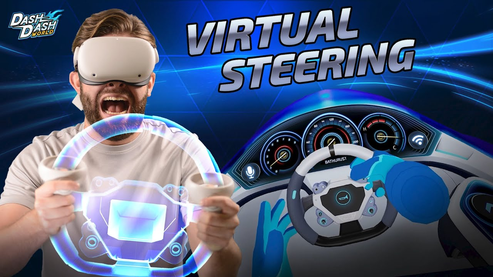

# steam-uevr-wheel 🌎

  

Hi, this repository contains a UEVR plugin that allows you to enjoy VR steering in UEVR games ;-)

### Note for users

This plugin has been made by me, because I'm tired of waiting for Mark Zuckerberg's implementation of Grand Theft Auto San Andreas in VR ;-)

If you want to get up and running with this plugin in GTA SAN ANDREAS: DE, follow [this tutorial](https://github.com/MaslowCorporation/GTA-SAN-ANDREAS-VR) designed to turn Grand Theft Auto San Andreas Definitive Edition into a fun VR experience, to see an example of this plugin in action.

Please note that this plugin can be used in ANY driving UEVR game, not just Grand Theft Auto ;-)

#### Quick tutorial for users

Download the `steam-uevr-wheel.zip` file from the [Releases page of steam-uevr-wheel](https://github.com/MaslowCorporation/steam-uevr-wheel/releases) ,

then unzip this file. Once unzipped, you'll get a `steam-uevr-wheel` folder. Place this folder in your `Documents` folder.

Your `steam-uevr-wheel` folder MUST BE located at `C:\Users\YOUR_WINDOWS_USER_NAME\Documents\steam-uevr-wheel`

Inside this `steam-uevr-wheel` folder, there's a `steam-uevr-wheel.bat` file. Double click this file to open steam-uevr-wheel.
A command line window will open. On the first opening, you'll get an error `No such file or directory: 'C:\\Users\\YOUR_USERNAME\\AppData\\Local\\steam-vr-wheel\\config.json' Load default?` . Choose `Yes`.

Okay ! Now, you need to install a tool called [vjoy](https://sourceforge.net/projects/vjoystick/)

Download and install the latest `vJoySetup.exe` from [this sourceforge.net page](https://sourceforge.net/projects/vjoystick/)

Okay ! Now, you need to download and add the `VRHands` UEVR plugin to your UEVR game folder.

Download the `VRHands.dll` and `libzmq-mt-gd-4_3_5.dll` files from the [Releases page of steam-uevr-wheel](https://github.com/MaslowCorporation/steam-uevr-wheel/releases) ,

Open your `UEVRInjector.exe` as admin, and click on `Open Global Dir` . It will open a File Explorer to the location where the UEVR game folders are. Locate the `GameFolder` folder, and copy paste your `VRHands.dll` and `libzmq-mt-gd-4_3_5.dll` files inside the `GameFolder/plugins` folder.
(NOTE: GameFolder is the name of the folder of your UEVR game)

Mission accomplished ;-) You have installed everything needed to use VR motion controls for cars/trucks/boats !

Using the VR steering wheel in-game is very simple.

- FIrst, press `Shift Key` on your keyboard, to get in `Wheel Setup` mode.
This mode allows you to position and resize the wheel the way you want it to be.
Press the left and right VR trigger buttons, and move your hands around and you'll see the wheel following your hand movements.
Get your hands apart from each other, and you'll see the wheel growing bigger, and vice versa when you get your hands closer together.

- Once you're satisfied with the wheel size and position, press `Shift Key` on your keyboard, to get in `Wheel Visible` mode.
Now your wheel is actually ready to work ;-)
Press your left or right controller VR grip button to turn/steer the wheel. ;-)

(IMPORTANT !) If the wheel is not properly aligned in-game, simply [recenter your SteamVR position](https://www.roadtovr.com/steamvr-recenter-reorient-playspace-forward-update/)
On Oculus headsets, press the left VR controller's menu button, to make the SteamVR VR menu appear,
then click the `Recenter` button in the bottom bar of the VR menu on-screen.
A countdown will appear. Look in the direction where you want the recenter to be made, and that's it. The steam-uevr-wheel will be properly recentered ;-)

See [the GTA-SAN-ANDREAS-VR tutorial](https://github.com/MaslowCorporation/GTA-SAN-ANDREAS-VR) as an example of how to get the plugin up and running in a UEVR game.

### Note for Developers

* To get up and running with the C++ side of steam-uevr-wheel, follow [this tutorial](./readme_assets/create_uevr_plugin/README.md)

* To make edits to the steam-uevr-wheel python program, 
the file containing the core wheel logic is [_wheel.py](./steam-uevr-wheel-dev/steam_vr_wheel/_wheel.py) , 
so edit this file to your heart's desire, if you know what you're doing ;-)

### Thank you for existing ;-)