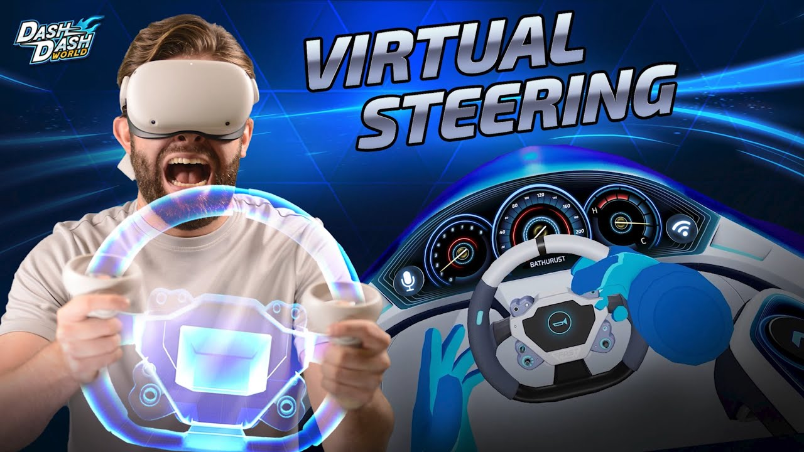

# steam-uevr-wheel 🌎

  

Hi, this repository contains a UEVR plugin that allows you to enjoy VR steering in UEVR games ;-)

### Note for users

This plugin has been made by me, because I'm tired of waiting of Mark Zuckerberg's implementation of Grand Theft Auto San Andreas in VR ;-)

If you want to get up and running with this plugin, follow [this tutorial](https://github.com/MaslowCorporation/GTA-SAN-ANDREAS-VR) designed to turn Grand Theft Auto San Andreas Definitive Edition into a fun VR experience, to see an example of this plugin in action.

Please note that this plugin can be used in ANY driving UEVR game, not just Grand Theft Auto ;-)

Because I'm currently physically and mentally tired (;-) and on the verge of homelessness, I didn't make a specific general tutorial for this plugin, so just take the [GTA-SAN-ANDREAS-VR](https://github.com/MaslowCorporation/GTA-SAN-ANDREAS-VR) tutorial as an example of how to get the plugin up and running in a UEVR game.

### Note for Developers

* To get up and running with the C++ side of steam-uevr-wheel, follow [this tutorial](https://github.com/MaslowCorporation/GTA-SAN-ANDREAS-VR/blob/main/readme_assets/create_uevr_plugin/README.md)

* To make edits to the steam-uevr-wheel python program, 
the file containing the core wheel logic is [_wheel.py](./steam-uevr-wheel-dev/steam_vr_wheel_dist/steam_vr_wheel/_wheel.py) , 
so edit this file to your heart's desire, if you know what you're doing ;-)

* To generate a .exe file for the python side of steam-uevr-wheel, go to the folder `.\steam-uevr-wheel-dev\steam_vr_wheel_dist` and run `python config.py build`

### Thank you for existing ;-)